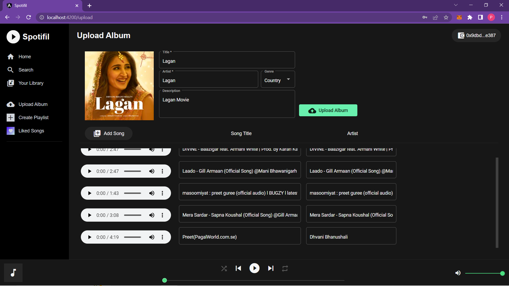
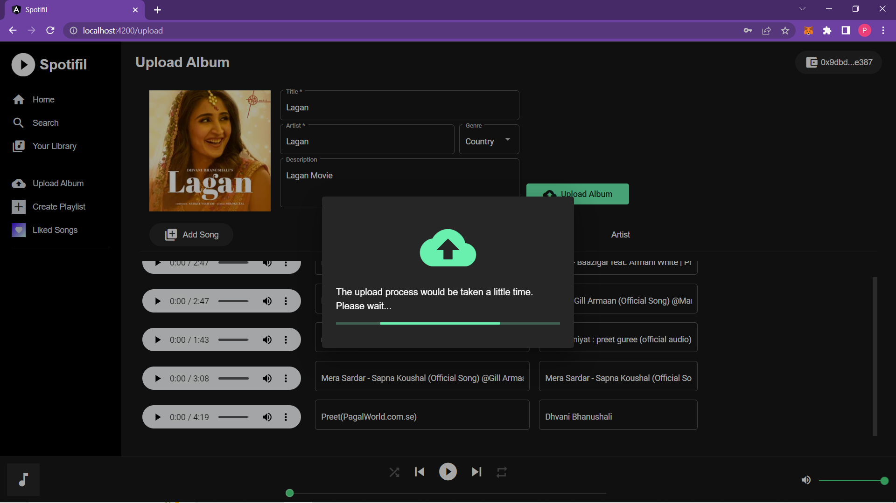
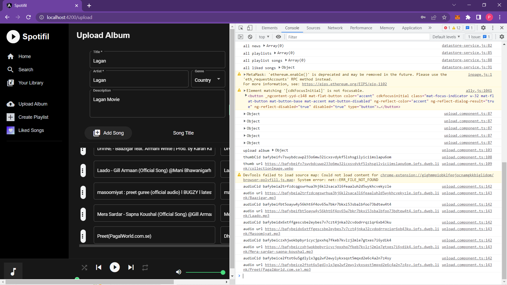

# SpotiFil FEVM
SpotiFil is a fully decentralized music-sharing platform with a community of artists, listeners, and developers who collaborate and share music. It is built on top of Filecoin EVM/IPFS.

### Working
Spotifil is a fully decentralized music-sharing platform with a community of artists, listeners, and developers who collaborate and share music. It is built on top of Filecoin EVM and Web3.Storage which is backed by Firecoin/IPFS. Features:
<li>Connect To Ethereum via Metamask FIL Hyperspace</li>
<li>Hash and Collection will be saved to FEVM Smart Contract</li>
<li>Upload audio files to Filecoin Storage</li>
<li>Data is stored  by IPFS
Search songs by title, artist, and genre
Create a playlist and add the liked songs on it
Play music by songs, album, or your playlists
</li>

## Tech Stack:
<li>FEVM</li>
<li>Angular, Material, TailwindCSS</li>
<li>Web3.Storage</li>
<li>IPFS</li>


## FEVM Contract Link:
<a href="https://hyperspace.filfox.info/en/address/0x5d9433D7E9d1f61f149eF013ef1eCdA7B4f85C7b"> https://hyperspace.filfox.info/en/address/0x5d9433D7E9d1f61f149eF013ef1eCdA7B4f85C7b </a>

## POLYGON MUMBAI Link:
<a href="https://mumbai.polygonscan.com/address/0x1c5659cd6f83d9b4c97a57c620a87ac281a3eb04">https://mumbai.polygonscan.com/address/0x1c5659cd6f83d9b4c97a57c620a87ac281a3eb04</a>

## Mantle Link:
<a href="https://explorer.testnet.mantle.xyz/address/0xd53C3fE2Ab82A74cd509169C1fF43d99d5269426">https://explorer.testnet.mantle.xyz/address/0xd53C3fE2Ab82A74cd509169C1fF43d99d5269426</a>


```sh
C:EthForAll\spotifil-contract>npx hardhat deploy --network hyperspace
Nothing to compile
Wallet Ethereum Address: 0x9dbd443B0F8848E2211Cc553eefe0dA65fdAE387
Deploying Spotifil...
Spotifil deployed to: 0x5d9433D7E9d1f61f149eF013ef1eCdA7B4f85C7b

C:EthForAll\spotifil-contract>npx hardhat deploy --network mantle
Nothing to compile
Wallet Ethereum Address: 0x9dbd443B0F8848E2211Cc553eefe0dA65fdAE387
Deploying Spotifil...
Spotifil deployed to: 0xd53C3fE2Ab82A74cd509169C1fF43d99d5269426

C:EthForAll\spotifil-contract>npx hardhat deploy --network mumbai
Nothing to compile
Wallet Ethereum Address: 0x9dbd443B0F8848E2211Cc553eefe0dA65fdAE387
Deploying Spotifil...
Spotifil deployed to: 0x1c5659cd6f83d9b4c97a57c620a87ac281a3eb04

```

## Video
<a href="https://www.loom.com/share/9082e14f45914cf48a1b41c334aee3b6"><h4>Loom:</h4>  https://www.loom.com/share/9082e14f45914cf48a1b41c334aee3b6</a>
<a href="./assets/Spotifil.mp4"><h4 style="color:red">Download</h4></a>


## Images





